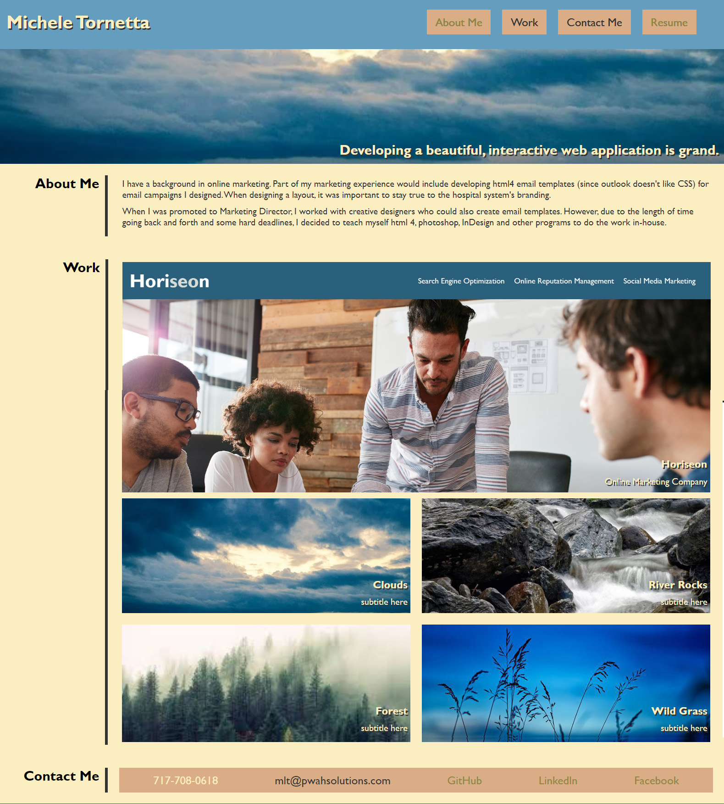

# Michele Tornetta - Portfolio

## User Story

As a web developer, I create web applications that are user friendly, follow best practices, and are accessible.  Each application should be writting in such a way that future changes are easy to do.  

## Accpetance Criteria

Given I need to show employers samples of my work.
When an employer visits my sight.
Then that employer will learn a little about me
When an employer visits my sight.
Then he/she/they/them will have the abilty to view a sampling of projects I have completed.
When an employer visits my sight
Then an employer will be able to contact me.

## Projects

Horiseon 1:  [Horiseon Website](https://micheletornetta.github.io/code_refractor/)
Pretend Project 2:  [Second Website](https://micheletornetta.github.io/code_refractor/)
Pretend Project 3:  [Third Website](https://micheletornetta.github.io/code_refractor/)
Pretend Project 4:  [Fourth Website](https://micheletornetta.github.io/code_refractor/)
Pretend Project 5:  [Fifth Website](https://micheletornetta.github.io/code_refractor/)

## Mock-Up

You will be able view several completed projects.  In each project you can see that each site is designed to be used on a variety of media types.  Each project is accessible with discriptive alt text.

The following the web application's appearance and functionality:

## Technology Preference

I would like to specialize in...

## Review

* Portfolio URL: https://micheletornetta.github.io/portfolio/
* GitHub repository URL: https://github.com/MicheleTornetta/portfolio